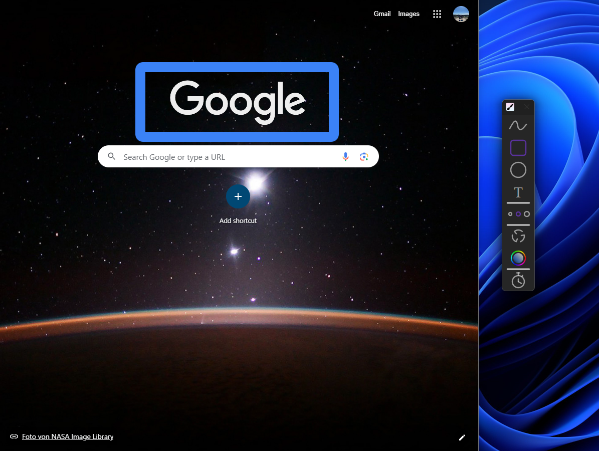
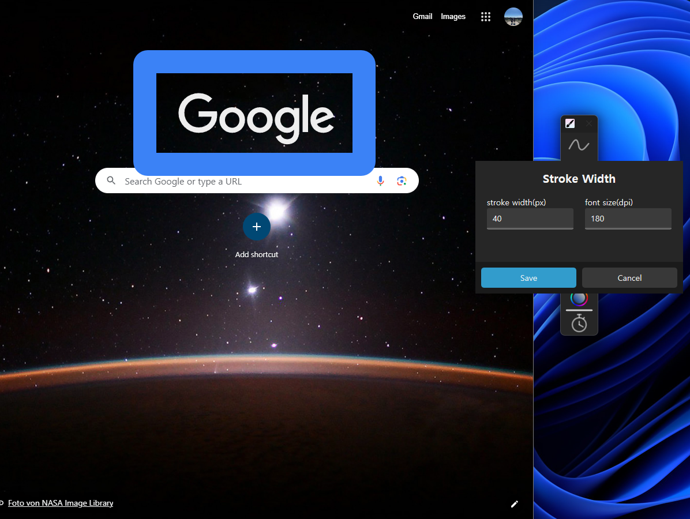
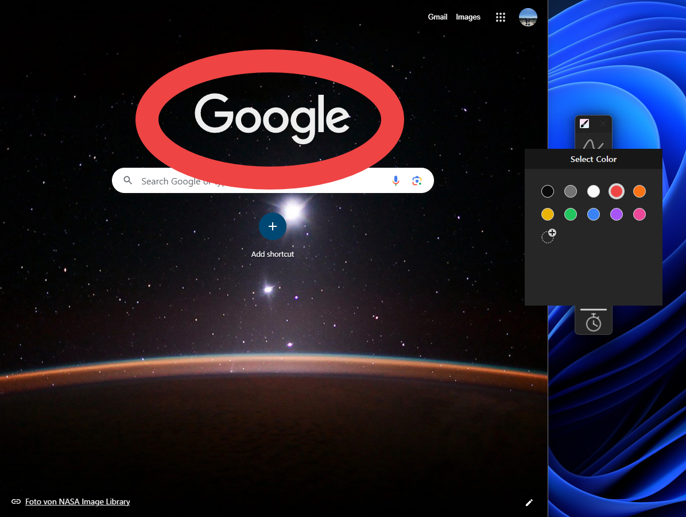
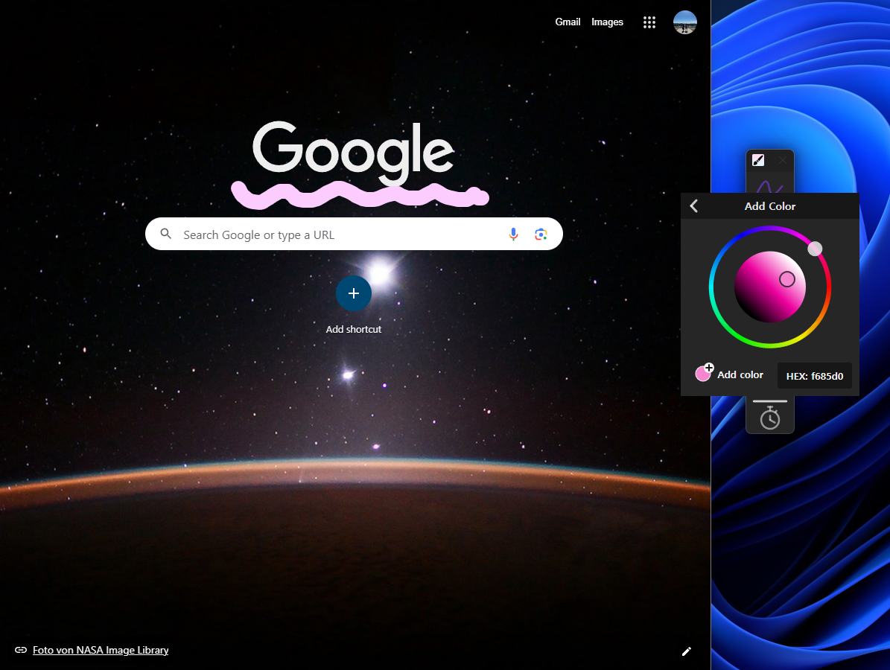
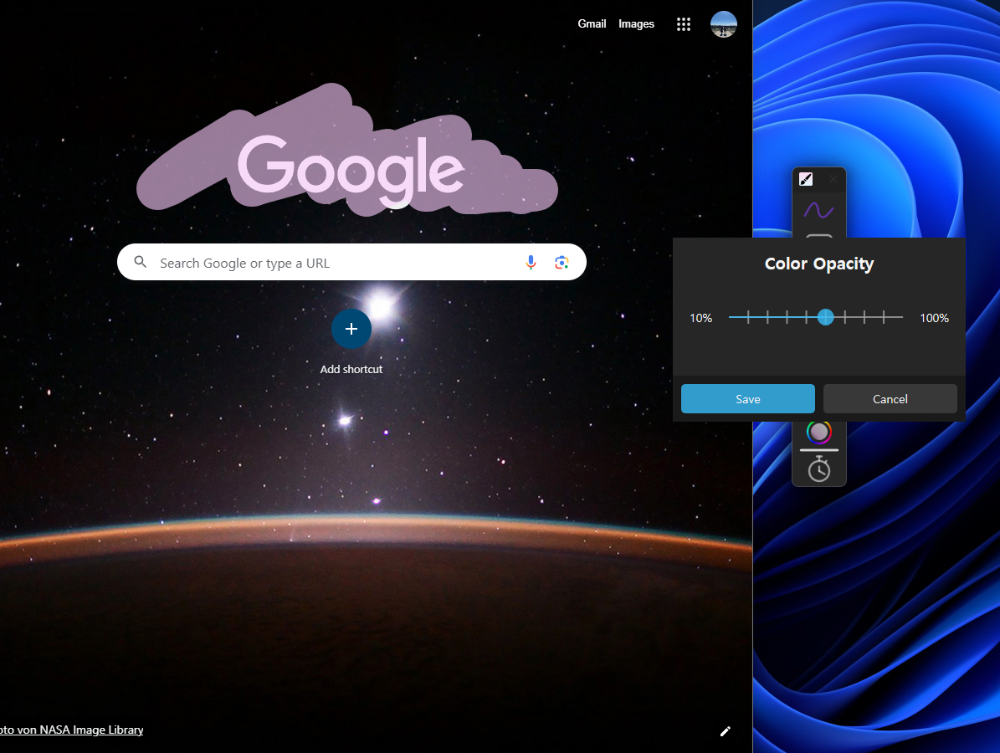
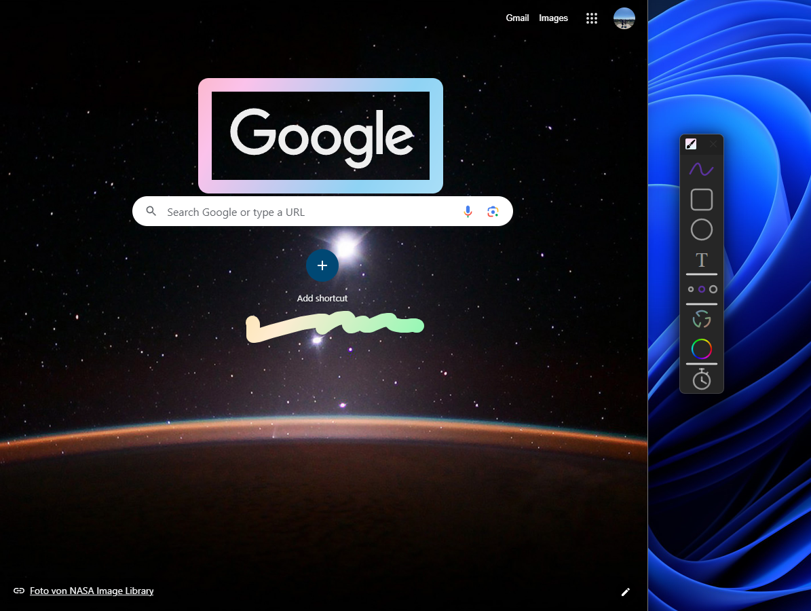
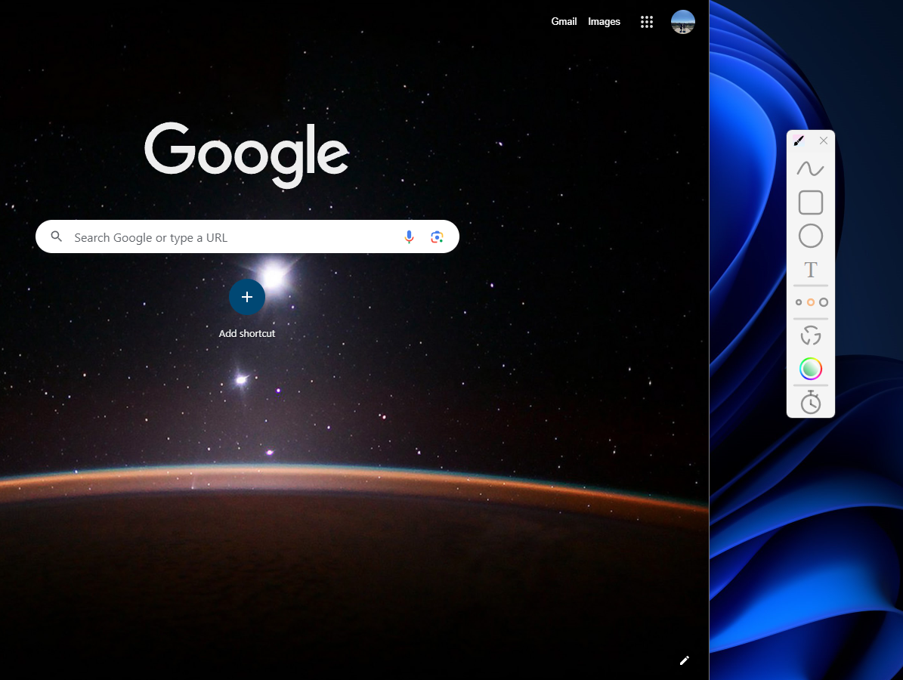
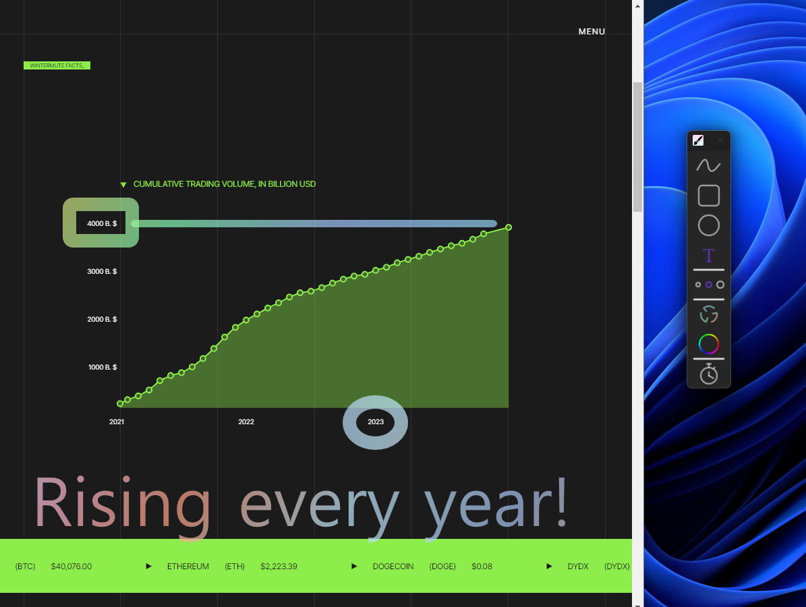

# WindowBrush

Draw over the selected entire screen.

Quick and useful to show something on the screen by drawing.

Designed to be easy and intuitive to use. A clean, modern and stylish interface always works as expected.

---

The first update version of WindowBrush.exe which was implemented with the MFC library.

In this version the AppTemplate library is used instead of the MFC library.

The AppTemplate is a library to make Windows Desktop Application easier by using Direct2D Rendering and Win32-API.

## How to run

Even if there is no virus, man can't download the executable file on website, so you must download the project and build it yourself. Clone this project and execute the WindowBrush.sln file with Visual Studio and just build.

## How to use

Select the screen you want to draw on at the setting mode ( Click the application icon in the top left corner ) and draw something by clicking the buttons or using hotkeys.

If you want to change some setting, click the application icon to open the option menu.

## Used tools

- C++
- Win32 API (especially Direct2d)
- Visual Studio

## Overview

- Draw a rectangle

---

- Set the stroke width

  

---

- Select the brush color

  

---

- Add a color for the brush

  

---

- Set color opacity for the brush

  

---

- Using a gradient brush

  

---

- Change from dark mode to light mode

  

---

- Example of usage

  
  
